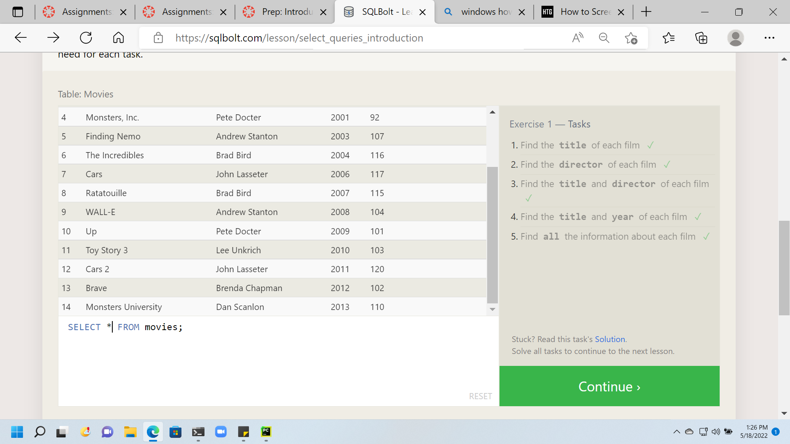
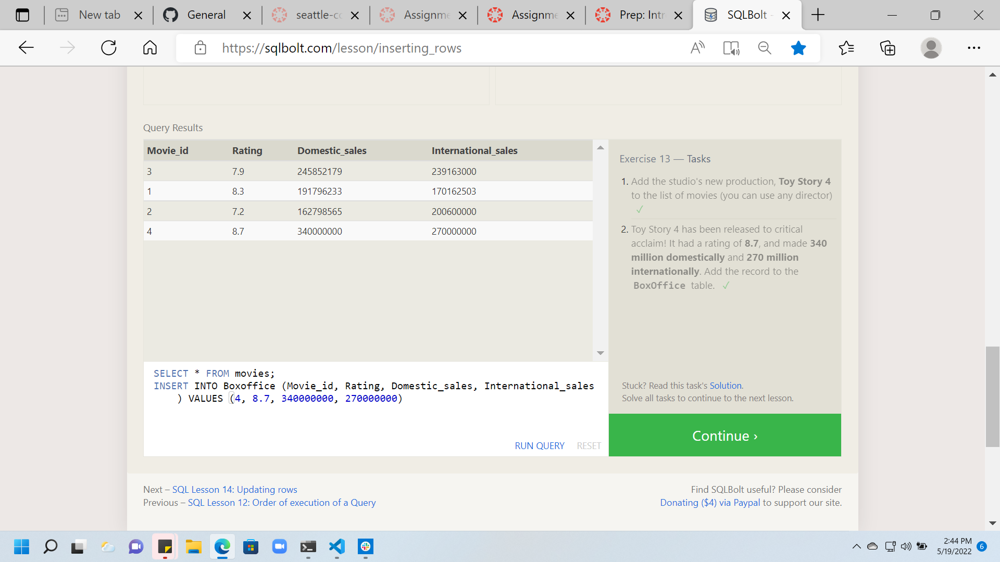

# Introduction to SQL

- I absolutely hated SQL before this tutorial. Mainly, I could never figure out how to create a table and link it to another table using join id's. It ultimately drove me to mongoDB and I have used that ever since. SQL is such a powerful tool and the relational DB setting is so convienient when you know how to apply it. 

- this tutorial helped me understand the basics of manipulating a table. I am so excited to see how powerful SQL is. I am not very strong at DB management and really want to work on more backend stuff over front end.

## things of note

i noticed that i wasnt using case sensitive practices but I was still getting desired results, does that mean I dont have to worry about case sensitivity and can really just write out my commands like i would as if i was just typing? if so, that will propel my understanding even further.

I also seemed to prefer 1 lines over seperating my lines out as compared to the tutorial. Im not sure what best practice is but the one liners was more readable for me. 

# screenshots 

.png)
.png)
.png)
.png)
.png)

.png)
.png)
.png)
.png)
.png)

